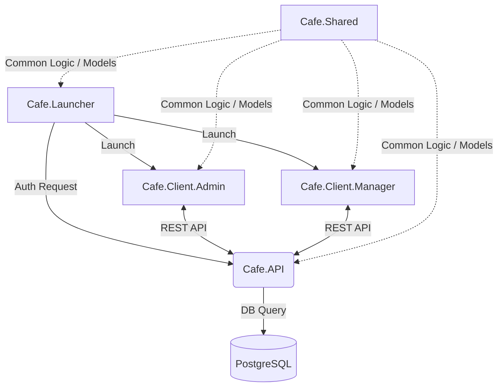

# ☕ Cafe System — Комплексна автоматизація кав'ярні
### Повнофункціональна екосистема на базі .NET 8, PostgreSQL та Custom UI Engine

Цей проект є комплексною курсовою роботою, що демонструє побудову клієнт-серверної архітектури з використанням сучасних паттернів проектування, кастомного графічного рушія та контейнеризації.

---

## 📖 Зміст
1. [Архітектура системи](#-архітектура-системи)
2. [Технічний стек](#-технічний-стек)
3. [Модулі проекту](#-модулі-проекту)
4. [База даних та Моделі](#-база-даних-та-моделі)
5. [Графічний рушій Sovereign UI](#-графічний-рушій-sovereign-ui)
6. [Інструкція з розгортання (Docker)](#-інструкція-з-розгортання-docker)
7. [Функціонал Користувача](#-функціонал-користувача)

---

## 🏗 Архітектура системи

Система побудована за принципом рознесення відповідальності (Separation of Concerns):



---

## 🛠 Технічний стек

- **Backend**: ASP.NET Core 8.0 (Web API)
- **Frontend**: C# WinForms (.NET 8)
- **Database**: PostgreSQL 16
- **ORM**: Entity Framework Core (PostgreSQL Provider)
- **UI Rendering**: GDI+ (Custom GDI Drawing)
- **Containerization**: Docker & Docker Compose
- **Shared Library**: .NET Standard 2.0 (для сумісності)

---

## 📦 Модулі проекту

### 1. Cafe.API (Центральний вузол)
Серверна частина, що керує бізнес-логікою.
- **Controllers**:
    - `ProductsController`: Керування асортиментом.
    - `OrdersController`: Обробка чеків та транзакцій.
    - `UsersController`: Аутентифікація та управління персоналом.
    - `CategoriesController`: Організація меню.
- **Middleware**: Обробка CORS, логування запитів та автоматична ініціалізація БД.

### 2. Cafe.Client.Manager (Робоче місце Касира)
Оптимізований інтерфейс для швидкої роботи.
- **SmoothGrid**: Кастомний контролер списку товарів з підримкою категорій.
- **SovereignLedger**: Розумний кошик з автоматичним розрахунком суми та видаленням позицій.
- **CheckoutOverlay**: Вікно завершення замовлення з вибором оплати та прив'язкою до касира.

### 3. Cafe.Client.Admin (Панель Власника)
Інструмент для моніторингу та налаштування.
- **Dashboard**: Візуальна аналітика за день/місяць (виручка, популярні товари).
- **Personnel Management**: Створення та редагування профілів співробітників.
- **Menu Editor**: Повний CRUD (Create, Read, Update, Delete) для товарів з можливістю групування за категоріями.

### 4. Cafe.Launcher (Шлюз)
- Реалізує "Безшовний" вхід.
- Має преміальну анімацію "пари кави" та глассморфізм-ефекти.

---

## 🗄 База даних та Моделі

Структура даних базується на наступних сутностях:

- **User**: ID, Username, PasswordHash (Plain-text для курсової), Role (Admin/Manager), FullName.
- **Product**: ID, Name, Price, CategoryId, Description, IsActive.
- **Category**: ID, Name.
- **Order**: ID, UserId, TotalAmount, CreatedAt, Status (Pending/Paid), Items (List).
- **OrderItem**: ID, ProductId, Quantity, PriceAtSale (фіксація ціни на момент продажу).

---

## 🎨 Графічний рушій Sovereign UI

Однією з головних особливостей проекту є кастомна візуалізація. Замість стандартних кнопок Windows, використовуються:
- **Smooth Corners**: Радіус закруглення 24px для всіх контейнерів.
- **Anti-Aliasing**: Вимушене згладжування тексту (`ClearTypeGridFit`) та графіки (`SmoothingMode.AntiAlias`).
- **Glassmorphism**: Використання напівпрозорих шарів (Alpha-channel 12-40) для створення глибини.

---

## 🐳 Інструкція з розгортання (Docker)

Для запуску потрібен встановлений **Docker Desktop**.

1.  **Клонуйте репозиторій**:
    ```bash
    git clone https://github.com/StanislavRudyk/coffesystem-.git
    cd coffesystem-
    ```
2.  **Запустіть базу даних**:
    ```bash
    docker-compose up -d
    ```
3.  **Запустіть API**:
    Відкрийте рішення в Visual Studio та запустіть проект `Cafe.API`.
4.  **Запустіть Клієнт**:
    Запустіть проект `Cafe.Launcher`.

---

## 🔑 Тестові акаунти (Default)

| Логін | Пароль | Роль | Опис |
| :--- | :--- | :--- | :--- |
| `admin` | `admin123` | **Admin** | Повний доступ до всього проекту. |
| `user` | `user123` | **Manager** | Тільки вікно продажів та замовлень. |

---

## 📈 Плани на розвиток
- Додавання підтримки фіскальних реєстраторів (ПРРО).
- Розробка мобільного додатку для кур'єрів.
- Інтеграція з Telegram-ботом для звітів власнику.

---
**Розроблено Станіславом Рудиком в рамках курсової роботи.**
